# Лабораторная работа 1. Работа с сокетами

Автор: **Сигаева Ксения**. Группа: **K3340**.

Номер в журнале: 26. Вариант 2 — решение квадратного уравнения.

## Цель

Изучить клиент-серверное взаимодействие через UDP и TCP, устройство HTTP
и одновременную работу нескольких клиентов.

## Средства реализации

Использован Go и его стандартная библиотека. Пакет `net` предоставляет TCP/UDP-соединения.
Для одновременной обработки подключений использованы горутины.
Общие данные чата и журнала защищены мьютексами.
HTTP-запросы разбираются и ответы формируются вручную, без HTTP-сервера из `net/http`.
Все команды ниже запускаются из корня `laboratory_work_1`.

## 1. Обмен по UDP

Файлы: `task1/server/main.go`, `task1/client/main.go`.
Сервер слушает `127.0.0.1:8001`, получает датаграмму через `ReadFrom`, выводит сообщение
и отправляет ответ через `WriteTo` по адресу отправителя.
Клиент отправляет `Hello, server`, получает и выводит `Hello, client`.
UDP сохраняет границы датаграмм, но не гарантирует доставку; у клиента установлен таймаут.

## 2. Вычисления по TCP

Файлы: `task2/server/main.go`, `task2/client/main.go`.
Адрес: `127.0.0.1:8002`. Клиент читает a, b, c с клавиатуры и отправляет строку
с тремя числами. Сервер решает уравнение ax² + bx + c = 0 и возвращает строку результата.
Граница сообщения — перевод строки: TCP передаёт поток байтов, а не отдельные сообщения.

Дискриминант: D = b² − 4ac. При D > 0 два корня, при D = 0 один,
при D < 0 действительных корней нет. При a = 0 обрабатывается линейное уравнение.
При некорректном вводе сервер возвращает сообщение об ошибке.

Примеры для демонстрации:

| Ввод | Ожидаемый результат |
| --- | --- |
| 1 -3 2 | 2 и 1 |
| 1 2 1 | -1 |
| 1 0 1 | Нет действительных корней |
| 0 2 -4 | Линейное уравнение, корень 2 |
| 0 0 0 | Бесконечно много решений |
| 0 0 1 | Решений нет |
| abc 2 3 | Ошибка ввода |

## 3. HTML-страница через HTTP

Файлы: `task3/main.go`, `task3/index.html`.
Сервер читает HTML-файл при запуске, принимает TCP-соединение, считывает заголовки запроса
до пустой строки и отправляет HTTP-ответ:

```text
HTTP/1.1 200 OK
Content-Type: text/html; charset=utf-8
Content-Length: <число байтов HTML>
Connection: close

<содержимое index.html>
```

В коде строки HTTP разделены `\r\n`. После ответа соединение закрывается.

## 4. Многопользовательский TCP-чат

Файлы: `task4/server/main.go`, `task4/client/main.go`. Адрес: `127.0.0.1:8004`.
Для каждого подключения сервер запускает `go handle(conn)`.
Первой строкой клиент передаёт имя, следующими — сообщения.
Сервер хранит соответствие соединений и имён, рассылает сообщения всем, кроме отправителя.
Мьютекс защищает карту клиентов и доступ к очередям рассылки.
У каждого клиента есть очередь на 64 сообщения и отдельная горутина записи с таймаутом 5 секунд.
При переполнении очереди медленный клиент отключается, не задерживая остальных.
При `exit` или разрыве соединения пользователь удаляется, остальные получают уведомление.

Один и тот же клиент запускается в нескольких терминалах. Получение сообщений и ввод
не блокируют друг друга благодаря горутине.

## 5. Веб-сервер GET/POST

Файл: `task5/main.go`. Адрес: `127.0.0.1:8005`.
Сервер обслуживает подключения в отдельных горутинах и вручную читает метод, путь и заголовки.
Тело POST считывается полностью по `Content-Length` через `io.ReadFull`.

| Запрос | Действие |
| --- | --- |
| GET / | HTML-форма и таблица оценок |
| POST / | Добавление subject и grade, перенаправление на GET / |
| Другой путь | 404 |
| Другой метод | 405 |

Форма передаёт `application/x-www-form-urlencoded`. Для разбора полей используется `url.ParseQuery`.
Оценки хранятся в `map[string][]int`: `Математика → [5, 4]`.
Запись оценок защищена `sync.RWMutex`. Для построения страницы под блокировкой
создаётся копия журнала; HTML формируется после освобождения блокировки.
Так каждый предмет представлен одной строкой таблицы. Названия предметов экранируются перед выводом HTML.
Выбрана шкала 2–5; оценки хранятся в оперативной памяти до перезапуска.
Длина тела запроса задаётся заголовком `Content-Length`. После ответа соединение закрывается.

## Демонстрация

### Задание 1

Запуск UDP-сервера.

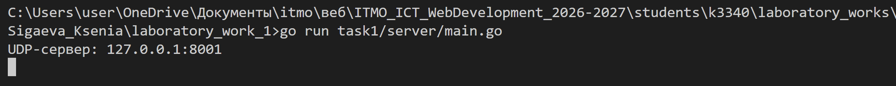
Получение сообщения клиента на сервере.

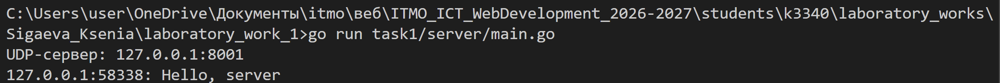

Ответ UDP-сервера клиенту.

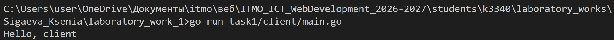

Повторное обращение к UDP-серверу.

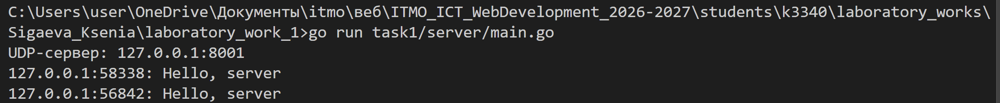

### Задание 2

Запуск сервера решения уравнений.

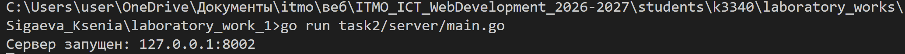

Два корня уравнения x² − 3x + 2 = 0.

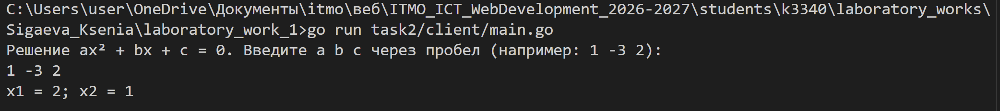

Решение линейного уравнения 3x + 4 = 0.

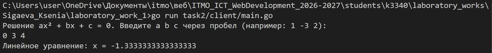

Сообщение при вводе двух коэффициентов вместо трёх.

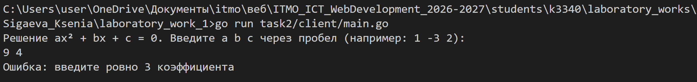

### Задание 3

Запуск HTTP-сервера.

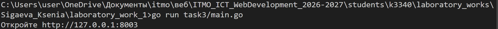

Страница из файла index.html в браузере.

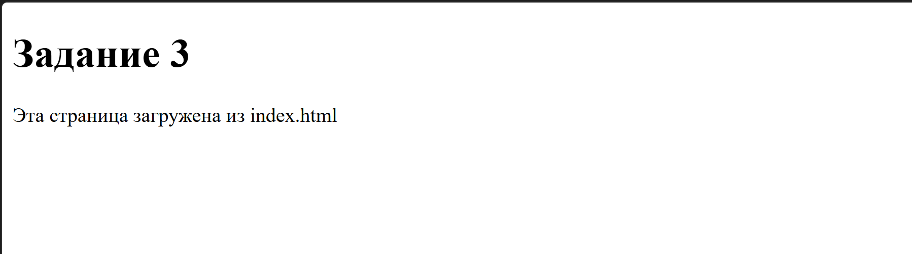

### Задание 4

Запуск сервера чата.

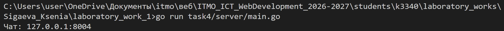

Переписка в терминале ennie.

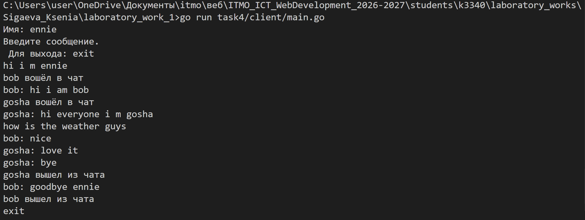

Переписка и выход пользователя bob.

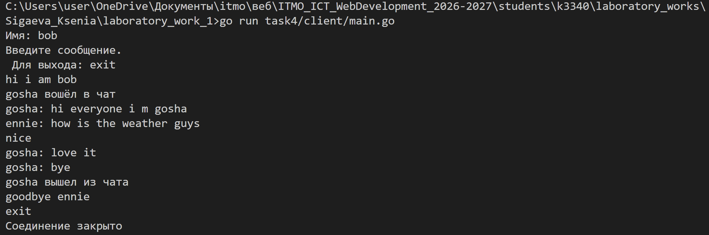

Переписка и выход пользователя gosha.

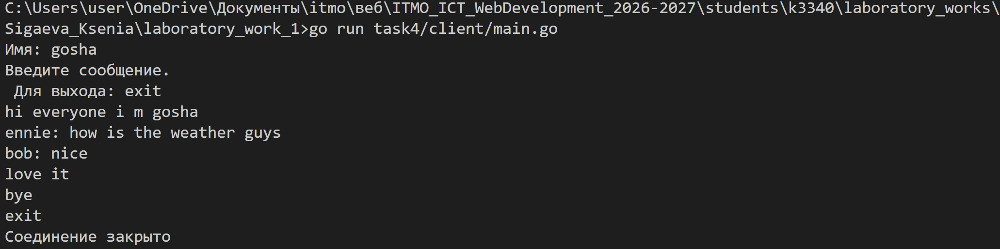

Подключение и отключение трёх участников на сервере.

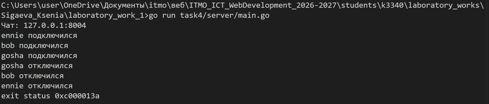

### Задание 5

Запуск сервера журнала оценок.

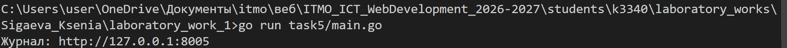

Журнал с оценками, сгруппированными по дисциплинам.

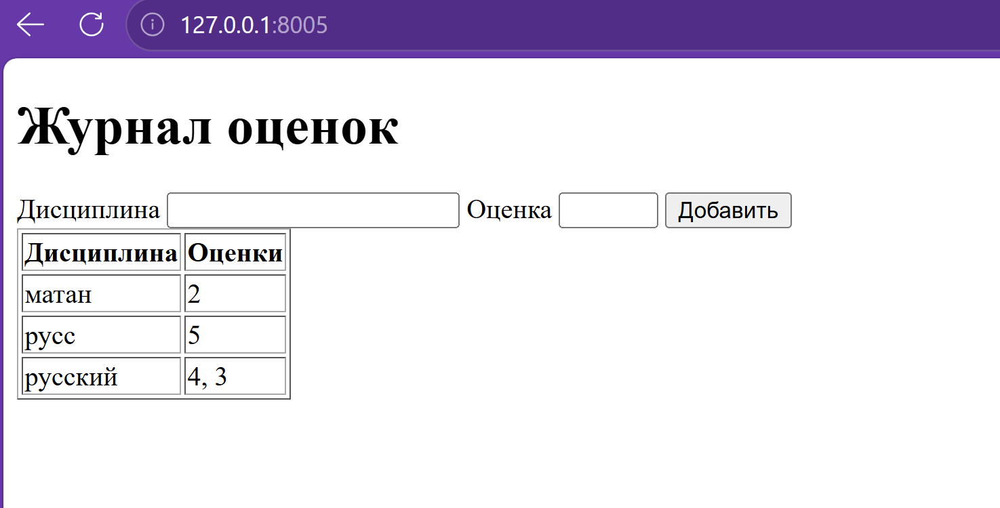

## Вывод

В ходе работы я изучила обмен данными через сокеты TCP и UDP на Go.
Для HTTP-серверов разобрала структуру запросов и вручную сформировала ответы.
В чате отделила отправку сообщений каждому клиенту, а в журнале защитила общие
данные от одновременного изменения несколькими обработчиками.

## Источник задания

[Методичка ЛР1](https://rendex85.github.io/ITMO_ICT_WebDevelopment_Docs/lab1/assignment/).
